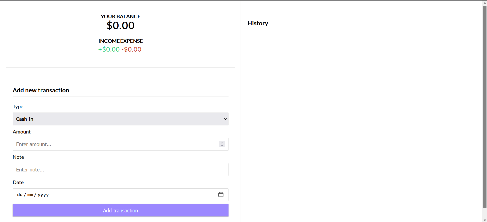

# Money Tracker Web App

This is my yet another project built during the Bharat intern program. It is a form built using HTML, CSS, Node.js, and MongoDB for the database. The webapp has very intiutive and user-friendly interface.

## Description
The Money Tracker Web App is a full-featured web application that allows you to track your financial transactions. It is connected to a local database, where all your transactions are securely stored. The web app is also fully responsive, ensuring a seamless user experience across different devices.

## Features
- Add new transactions with details such as date, category, amount, and description.
- View a list of all transactions, sorted by date or category.
- Filter transactions by date range or category.
- Edit or delete existing transactions.
- Generate reports and visualizations to analyze your spending habits.

## Installation
1. Clone the repository: `git clone https://github.com/username/money-tracker-webapp.git`
2. Install the required dependencies: `npm i`
3. Set up the local database: `mongodb://localhost:27017/transact`
4. Configure the database connection in the `index.js` file.
5. Start the web app: `nodemon`
6. Open the web app in your browser: `http://localhost:5000`

## Technologies Used
- HTML, CSS, JavaScript
- Node.js
- Express.js
- MongoDB

## Contributing
Contributions are welcome! If you find any issues or have suggestions for improvements, please open an issue or submit a pull request.