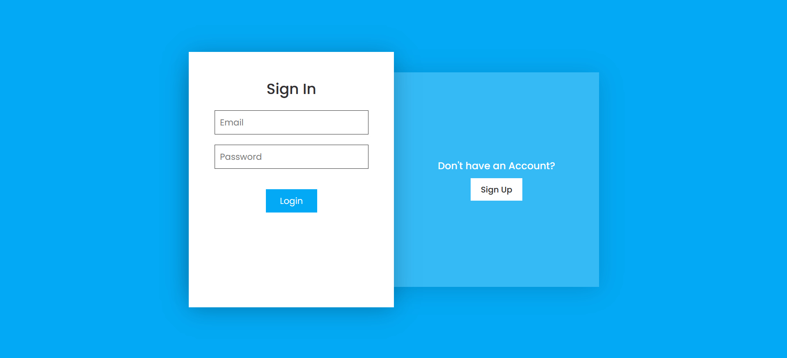

# SignIn / SignUp Form

<!-- insert sample.png image here present in same folder -->

This is my first project built during the Bharat intern program. It is a form built using HTML, CSS, Node.js, and MongoDB for the database. The form is fully responsive.

## Installation

To install and run this project on your local computer, follow these steps:

1. Clone the repository: `git clone https://github.com/username/repo.git`
2. Navigate to the project directory: `cd repo`
3. Install the dependencies: `npm i`
4. Start the server using nodemon: `nodemon`
5. Open your web browser and visit `http://localhost:3000` to access the form.
6. To access the database, you can use MongoDB Compass or the MongoDB shell.
7. Connect to the database using the following URI: `mongodb://localhost:27017/signin-signup` in MongoDB Compass or the MongoDB shell.
8. You can view the data in the `UserSignUps/users` collection.
9. To stop the server, press `Ctrl + C` in the terminal.

## Usage

Once the server is running and you have accessed the form in your web browser, you can start using it to collect data from users. Any data entered into the form will be stored in the MongoDB database.

## Contributing

If you would like to contribute to this project, please follow these steps:

1. Fork the repository
2. Create a new branch: `git checkout -b feature/your-feature`
3. Make your changes and commit them: `git commit -m 'Add your feature'`
4. Push to the branch: `git push origin feature/your-feature`
5. Submit a pull request
